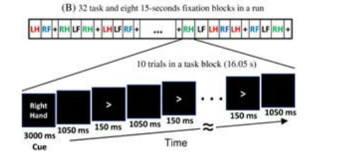

Tasks:

    Working Memory (Two 10 minute scans)
    Story Math (Two 7 minute scans)
    Motor (Two 14 minute scans
# 目录结构

一个主题（个人），会有十一组数据，包括工作记忆，静息态等。此处只选取motor实验的数据，也就是编号10,11（10-Motort）

c，rfDC文件包含原始数据，e，rfhp1.0Hz，COH文件包含扫描开始时的头部定位数据，e，rfhp1.0Hz，COH1文件包含扫描结束时的头部定位数据。config文件包含其他头信息。

处理级别：Unprocessed,Preprocessed,Source-level processed(averaged event-related andtime-frequency responses)

# 事件问题

具体实验：
- 4*8个task，每个task有10个起搏刺激（trial），一共320个trial。
- 3000ms cue，1050ms空，150ms箭头提示。
- 有八个15秒的fixation休息块（加上前后是10个）。
- 一共两次实验，每个运行由42个块组成。这些块中有10个是静止块，每个电动执行器有8个运动块。每个电动执行器总共产生80个动作。

sti014时间触发通道，只有mag通道

events:第一列样本号，第二列一般忽略，第三列事件ID

本实验中，cue就是开始指示下面要做的一组运动（幻灯片显示单词“ Left Hand”开始一组左手动作），然后每次trigger动左手。

注意，events读取会有一些事件id对不上号，其实就是相应的一些事件id加了256，如22——>278（触发通道上的信号由2个叠加的触发序列组成。一种来自运行E-Prime协议的刺激PC，另一种来自放置在刺激演示屏幕上的光电二极管）。每当显示器上出现提示刺激或起搏箭头时，光电二极管就会激活。当显示器为黑色时，它被禁用。 on的触发值为255，off的触发值为0。一般理解成off的时候做动作，也就是22,130这种trigcode附近在动？

事件ID|出现次数|事件描述
:-:|:-:|:-:
18|4|TrigCodLeftHandCue
22|80|TrigCodLeftHand
130|8|TrigCodRightFootCue
134| 80|TrigCodRightFoot 
66| 8|TrigCodRightHandCue
70| 80|TrigCodRightHand
34|2|TrigCodLeftFootCue
38| 80|TrigCodLeftFoot
2||TrigCodFixation 放松身体的点

# 预处理要改进的点

- find_events()方法中min_duration不同事件不同处理？
- epoch滤波问题？这块必须搞清楚

- 数据归一化要不要做

# 具体实验问题

## eegnet

注意维度问题，里面对应的网络模型有一些参数需要修改

