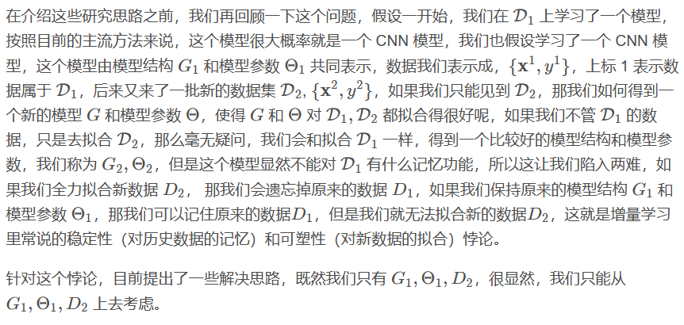
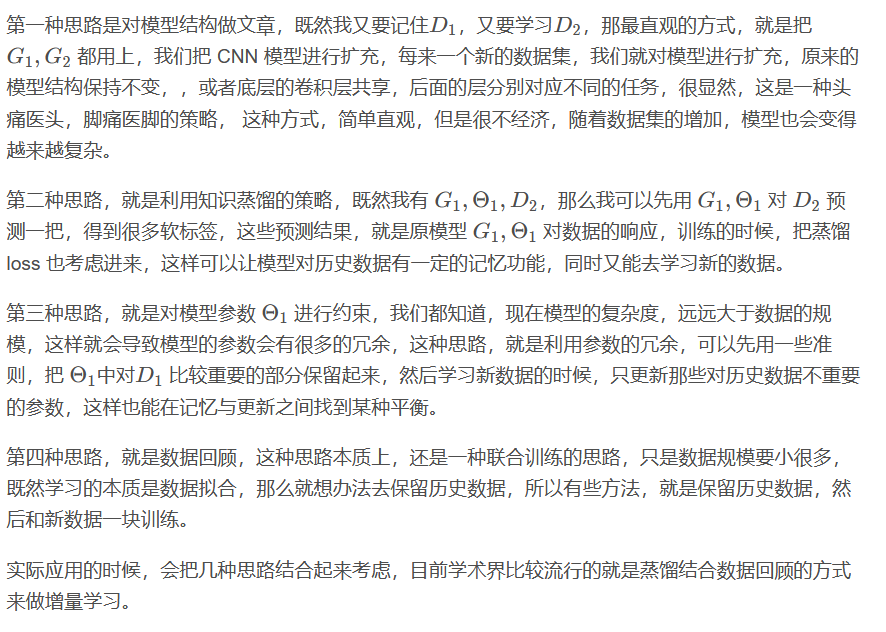

<!-- TOC -->

- [[Expirement]实验相关的数据集，操作等等小记](#expirement%E5%AE%9E%E9%AA%8C%E7%9B%B8%E5%85%B3%E7%9A%84%E6%95%B0%E6%8D%AE%E9%9B%86%E6%93%8D%E4%BD%9C%E7%AD%89%E7%AD%89%E5%B0%8F%E8%AE%B0)
- [[Classification]Adaptive neural network classifier for decoding MEG signals](#classificationadaptive-neural-network-classifier-for-decoding-meg-signals)
    - [网络结构](#%E7%BD%91%E7%BB%9C%E7%BB%93%E6%9E%84)
    - [训练](#%E8%AE%AD%E7%BB%83)
    - [数据](#%E6%95%B0%E6%8D%AE)
- [[Classification]Assessing impact of channel selection on decoding of motor and cognitive imagery from MEG data](#classificationassessing-impact-of-channel-selection-on-decoding-of-motor-and-cognitive-imagery-from-meg-data)
- [[Database]CAM-CAN DATABASE](#databasecam-can-database)
    - [MEG session（BIDS standard）](#meg-sessionbids-standard)
- [[CNN Improvement]Signals2Image](#cnn-improvementsignals2image)
    - [EEG signal2Image](#eeg-signal2image)
    - [Brain2Image: Converting Brain Signals into Images](#brain2image-converting-brain-signals-into-images)
- [[SVM] SVM on E/MEG](#svm-svm-on-emeg)
    - [Across-subject offline decoding of motor imagery from MEG and EEG](#across-subject-offline-decoding-of-motor-imagery-from-meg-and-eeg)

<!-- /TOC -->

# [Expirement]实验相关的数据集，操作等等小记

# [Classification]Adaptive neural network classifier for decoding MEG signals
+ 感觉诱发反应，感觉诱发反应的空间形貌可能因受试者而异，但其潜伏期可能相对恒定。/事件相关震荡响应相反，事件相关(诱导)振荡响应的相位在不同试验中可能会有相当大的变化，而其光谱内容和空间分布保持相同。
+ MEG数据 n X t,n是传感器数量，t是测量的时间点
+ 针对密集的空间和时间采样信号，可以用一些方法有效分离。参考Cardoso, J.-F., 1998. Blind signal separation: statistical principles.

## 网络结构
+ L1正则化可以产生稀疏权值矩阵，即产生一个稀疏模型，可以用于特征选择；L2正则化可以防止模型过拟合（overfitting）；一定程度上，L1也可以防止过拟合。[--关于正则化](https://blog.csdn.net/jinping_shi/article/details/52433975)
+ 输出层增大稀疏性，稀疏性使用L1范数正则化施加在输出层的权重上，抑制了与分类无关的大部分活动。一类输出 n=k*(t/p) 个参数（p是池化层参数），m个分类有m*n个参数

## 训练
+ 初始化和培训。从均匀分布中提取权重矩阵的初始值。参考He, K., Zhang, X., Ren, S., Sun, J., 2015. Delving Deep into Rectifiers: Surpassing Human-
Level Performance on ImageNet Classification
+ svm相关：各种特征提取方法与线性分类器相结合对MEG数据进行跨主题分类(Halme和Parkkonen，2018年)。支持向量机(Vapnik，2000)广泛应用于
MEG数据的分类(例如，Gramfort等人，2013b；Westner等人，2018年)。
+ CNN相关：
  + 浅FBCSP-CNN(Schirrmeister et al.，2017)是一种受滤波器组公共空间模式(FBCSP)启发的模型，FBCSP是一种在EEG/MEG中提取频带功率特征的最先进方法。（一维时间卷积输入层(40个滤波器)，空间滤波器层(40个滤波器)和平均池。Softmax预测。）
  + EEGnet：一维深度方向和可分离的卷积层(总共4层)
  + VGG19：结构复杂，数据为了适应所做的处理也相对复杂。

## 数据
+ 以1000 Hz的频率采样，带通滤波至1-45 Hz，然后降采样至125 Hz，因为较高的带宽和采样率在增加计算时间的同时不会显著改善性能。
+ 实验1：5种感觉事件相关场的分类。（ERF）数据
+ 实验2：3类运动表象任务中事件相关振荡活动的分类。(详情见Halme和Parkkonen，2018年)
+ 实验3：实时运动图像脑机接口
+ 实验4：在CamCAN数据集上对两种类型的感觉刺激进行分类。(被动)视听任务，该任务包括120次单峰刺激试验(60次视觉刺激

# [Classification]Assessing impact of channel selection on decoding of motor and cognitive imagery from MEG data

    Motor imagery (MI)运动图像的分类
    与102个磁力计相比，选择204个梯度计可提供更高的SNR，因为该梯度计对更靠近头皮的皮层激活变化率更为敏感。 
    数据集包括四个心理成像任务：手运动，脚运动，减法和单词生成。每个环节包括针对每个图像任务的50次试验，共200次试验。
    对于特征提取，数据从1 kHz下采样到500 Hz。经过预处理后，从每个实验中选择与图像活动相关的3.5s的数据段(提示后0.5s)，并分别为每个任务的每个脑磁图梯度计通道(即手、脚、数学和文字生成)估计信号功率。
- 使用线性判别分析(LDA)分类器对6个二元分类任务(即手与脚(H-F)、手与字(H-W)、手与数学(H-M)、脚与字(F-W)、脚与数学(F-M)和字与数学(W-M))进行了10倍交叉验证CA估计
- 信道选择方法
   - 类别相关性 class-correlation method
   - 随机森林RF
   - 无限潜在特征选择(ILFS)
   - RandF based ranking
- CSP进行二分类的特征提取

结论：
- 通道选择会提高精度
- 运动和认知图像（h-w）的分类效果比纯运动（h-f）或认知图像（w-m）效果好
- 使用α（8–12 Hz），β（13–30 Hz）或宽带（α+ β）（8–30 Hz）。还观察到，α频段的性能优于β和宽带频段。
- 通道下降1-25不等

# [Database] Human Connectome Project（HCP,人类连接计划） with MEG  
- 设备：4D Neuroimaging，不同于306那个设备。248mag磁力计channels（问题，磁力计的snr不如grad梯度计），23个参考通道，2034.5101Hz采样率？
- Data Type：
   - Reating State MEG（rMEG）：在每个实验阶段的开始时，将收集三次连续的rMEG运行，在此期间，指示受试者静静地躺着，并注视眼睛。
   - TASK MEG(tMEG):三种实验范式将用于提供有关感觉运动，工作记忆和语言处理的数据。
      - 在感觉运动任务中，参与者执行简单的手或脚运动。视觉提示指示哪一侧的肢体，主要在α（μ），β和γ带
      - 在工作记忆任务中，向参与者展示工具或面孔的图片，工作记忆任务主要激活前额叶和顶叶皮层区域，匹配和不匹配响应分别通过右食指和右中指按钮的按下来记录。
      - 语言处理任务，受试者将听取听觉叙述（持续30 s）或匹配持续时间的简单算术问题，然后听一个2选的强迫选择问题。受试者将通过按下右手按钮（食指或中指）做出反应。对MEG来说比较复杂

# [Database]CAM-CAN DATABASE 
## MEG session（BIDS standard）
+ 更大的基于人群的样本；年龄分布被选择为大致均匀的
+ 由102个磁力计和204个正交平面梯度计组成的306通道矢量系统(Elekta Neuromag)，采集脑磁图数据。数据采样频率为1 kHz，带通滤波器为0.03-330 Hz
   + Resting state:8mins闭眼休息静息态
   + Sensorimotor task：单峰试验，参与者要么只听到音调，要么看到棋盘。双峰试验，参与者在中央注视的左侧和右侧看到两个棋盘(持续时间为34毫秒)，并同时在三个频率(300、600或1200 Hz)中的一个频率上听到300毫秒的双耳音调。每一次试验中，参与者如果听到或看到任何刺激，都会用右手食指按下按钮来回应。在此之后，还有一个额外的被动阶段，在该阶段中，每1秒呈现120次单峰刺激试验，一半呈现三个频率(300、600或1200 Hz)之一的听觉音调，持续300毫秒，另一半呈现棋盘图案，持续34毫秒，不要求参与者做出运动反应。这个被动阶段的目的是独立地估计听觉和视觉诱发反应，以帮助在主要感觉运动任务中分离听觉和视觉反应。
   + Sensory (passive) task：视觉听觉任务

# [CNN Improvement]Signals2Image
## EEG signal2Image
+ AEP电极的位置从三维空间投影到二维表面
+ 在32×32网格上估计电极间的值。对每个感兴趣的频带重复该过程，产生对应于每个频带的三个地形活动图。然后将这三个空间地图合并在一起以形成具有三个(颜色)通道的图像。（抽象，很难理解）
+ 根据图片训练的特征集合进行反向CNN显示feature map和feature图像，特征图片的可解释性似乎不如文章（Ivan Zubarev a, Rasmus Zetter，2019）的解释性好。

## Brain2Image: Converting Brain Signals into Images
+ 通过脑电图记录的大脑信号可以用来理解人类正在看到的东西。但它并不是一个真正的读心过程，因为潜在的特征只被用于自动分类，而没有“看到”人类正在看到的东西
+ 编码器（LSTM，做特征向量的提取，用的文献中引用26的结果）和解码器（VAE和Gan做生成模型的训练，特征转换成图片，这两个算法都是非监督学习）组成，
+ VAE与AE的不同之处是：VAE的encoder产生与noise作用后输入到decoder。VAE的decoder的输出与某一张越接近越好，但是对于机器来说并没有学会自己产生realistic的image。
+ GaN由一个发生器和一个鉴别器组成
+ VAE能更好地表现物体结构，但清晰度较低。GaN相反

# [SVM] SVM on E/MEG
## Across-subject offline decoding of motor imagery from MEG and EEG
+ MTL（Multi-task learning）配合L1,L2正则化更适合运动想象（MI,Motor Imagine）训练，而CSP（common spatial pattern）更适合被动运动（PM，Passive Motor）训练
+ Table2显示了不同方法对MEG MI数据的分类精度结果
+ 特征提取和分类：空间滤波和LDA。在CSP滤波之前，使用空间谱分解(SSD)对数据进行降维。

# [模型]增量学习

当数据持续出现的时候，模型是否能对过往的数据保持记忆功能，同时又能拟合新来的数据。在test data上用

问题介绍：

解决思路：

